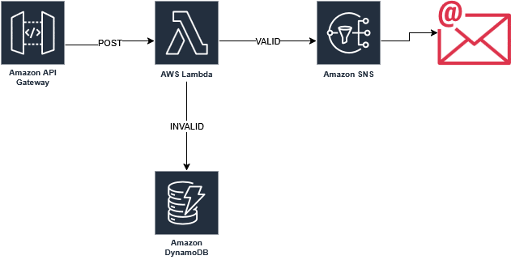

# This project is made for educational purposes

To met my friend needs I used:

- API Gateway with POST Method ✅
- Lambda Function witch receives data (orders info) as JSON. ✅
- DynamoDB to store INVALID orders. They need to be checked and if there is malicious attack by hackers, it has to be reported to the authorities. ✅
- SNS Topic to send notifications via e-mail only for VALID orders. ✅

My friend asked me to add automated deletion for the items in DynamoDB. I personally don't recommend that.
In my opinion every INVALID order must be checked manually. If there is a hacking attempt, this data must be stored for a longer period,
because the authorities usually need more time tо check everything. I know it sounds hard thing to do if the amount of requests is above million,
but my friend want to have the valid orders via mail anyway, so maybe my friend have workers. 
(I hope Sisi will not make me check them myself. :sweat_smile: ) 
However, this task can be achieved in various ways. One of them is with second Lambda function with event bridge.
The Lambda can be setup to check the datetime of the invalid order and if the limit is passed (for example 30 minutes) it can delete
the order and then send a notification. The Event Bridge can have a rule to run the lambda every 30-60 minutes.
Of course this is going to cost more. If the lambda function is triggered once every 30 minutes and uses SCAN to check the items,
then the price for DynamoDB will be around $360 (per month) for a million items.

To TEST this project before deployment simply use **npm test**

To USE this project you need POSTMAN. After creating an account you can send POST requests in JSON format.

💰 **PRICING:**
API Gateway - 3,000,000 JSON objects * $3.70 (for eu-central-1) ~ $11.10 per month
LAMBDA ~ $1.00 per month
DynamoDB and SNS Topic notification ~ $2.50 per month

The average price without anything extra is around $14 a month.

Example of VALID order:

{
"valid": true,
"value": 12,
"description": "5W40 motor oil",
"buyer": "Hristo"
}

Example for INVALID order:

{
"valid": false,
"value": 0,
"description": "Hacker attack",
"buyer": "Nobody"
}

## Useful commands

* `npm run build`   compile typescript to js
* `npm run watch`   watch for changes and compile
* `npm run test`    perform the jest unit tests
* `npx cdk deploy`  deploy this stack to your default AWS account/region
* `npx cdk diff`    compare deployed stack with current state
* `npx cdk synth`   emits the synthesized CloudFormation template
